# Norwegian Runic Keyboard

Type modern Norwegian in medieval runes — as a real keyboard layout, on
Linux, macOS and Windows, in a typeface built for it.

```
det er ikke lett å skrive norsk med runer
ᛑᛂᛏ ᛬ ᛂᚱ ᛬ ᛁᚴᚴᛂ ᛬ ᛚᛂᛏᛏ ᛬ ᚭ ᛬ ᛋᚴᚱᛁᚡᛂ ᛬ ᚿᚮᚱᛋᚴ ᛬ ᛘᛂᛑ ᛬ ᚱᚢᚿᛂᚱ
```

Every Norwegian letter sits on the key you already press for it, **æ ø å
included**. It is a second keyboard layout you toggle into, like adding a
language — so it works in every application, not just in one text box.

## The mapping

Strict one-to-one over all 29 letters, so it round-trips exactly.

| | | | | | | |
|---|---|---|---|---|---|---|
| **a** ᛆ | **b** ᛒ | **c** ᛍ | **d** ᛑ | **e** ᛂ | **f** ᚠ | **g** ᚵ |
| **h** ᚼ | **i** ᛁ | **j** ᛃ | **k** ᚴ | **l** ᛚ | **m** ᛘ | **n** ᚿ |
| **o** ᚮ | **p** ᛔ | **q** ᛩ | **r** ᚱ | **s** ᛋ | **t** ᛏ | **u** ᚢ |
| **v** ᚡ | **w** ᚥ | **x** ᛪ | **y** ᚤ | **z** ᛎ | **æ** ᛅ | **ø** ᚯ |
| **å** ᚭ | | | | | | |

The dotted runes are the medieval innovation: ᚵ is ᚴ with a dot (k→g), ᛑ
is ᛏ dotted (t→d), ᛔ is ᛒ dotted (b→p), ᚡ is ᚠ dotted (f→v), ᛂ is ᛁ
dotted (i→e). That is how medieval scribes clawed back the distinctions
Younger Futhark's 16 runes had lost.

**One system, and only one.** Every rune here is medieval Norwegian.
Nothing from Elder Futhark, nothing from the Anglo-Saxon futhorc — those
are different traditions, separated from medieval Norway by centuries and
a sea. The build refuses to run if one of their codepoints creeps in.

**Shift is not a second alphabet.** Runes have no case, so shift gives the
plain Latin capital — you can drop a name or a URL into runic text without
leaving the layout. The only exceptions are `,` `.` `-`, which give the
word dividers ᛫ ᛬ ᛭. Run `./rune --table` for every rune and its name.

## Runa, the typeface

**[Download Runa-Regular.ttf](dist/font/Runa-Regular.ttf)** · SIL Open Font
License 1.1 · 33 glyphs, ~6 KB

Runa is generated rather than drawn. `runefont.py` builds it from the same
skeletons the keyboard layouts use, so the font and the layout cannot drift
apart. Change a skeleton, run `python3 runefont.py`, and the typeface
follows.

The construction is orthogonal: every bend is a right angle softened by a
corner radius. Side branches sit at their geometric maximum, which makes
each a true quarter circle; `u`, `w` and `y` are capped by a single
semicircle; the bowls of `b` and `p` are one continuous arc. Free stroke
ends are rounded, but ends landing on the baseline or cap height stay flat
so the text line holds.

To install it, copy the TTF to `~/.local/share/fonts` (Linux) or open it and
click Install (macOS, Windows).

**[Glyph editor](dist/web/glyphredigerer.html)** — drag the skeletons, set
per-corner radii, and export the Python straight back into `runefont.py`.

## Also in here

- **[Cheat sheet](dist/cheatsheet/runic-cheatsheet.pdf)** — one printable A4
  page, in Norwegian. Laid out as a picture of the keyboard, so you look a
  rune up by finding the key your finger is already on.
- **[Runespill](dist/web/game.html)** — a word appears in runes, you type it
  back in Norwegian. Words get longer as you improve. One self-contained
  HTML file; open it in any browser, including on a phone.

Both embed a subsetted Noto Sans Runic (~6KB) so the runes render even on
macOS and phones, which ship no runic font.

## Install

### Linux — no admin

```sh
dist/linux/install.sh
```

Copies the layout to `~/.config/xkb/symbols/runic`. Needs libxkbcommon
1.0+. User-level layouts do **not** appear in most desktop settings GUIs
(that list is built from the system-wide `evdev.xml`), so activate it in
config:

| Desktop | Where |
|---|---|
| COSMIC | `~/.config/cosmic/com.system76.CosmicComp/v1/xkb_config` → `layout: "runic"` |
| Sway | `input * xkb_layout "no,runic"` |
| Hyprland | `kb_layout = no,runic` |
| X11 | `setxkbmap runic` |

To make it appear in a GNOME/KDE settings list you must install
system-wide instead: copy the file to `/usr/share/X11/xkb/symbols/` and
add an entry to `/usr/share/X11/xkb/rules/evdev.xml`. That needs root and
gets overwritten when `xkeyboard-config` updates.

### macOS — no admin

1. Copy `dist/macos/Runic.keylayout` to `~/Library/Keyboard Layouts/`
2. **Log out and back in** (macOS only scans that folder at login)
3. System Settings → Keyboard → Text Input → Edit → **+** → Others →
   Norwegian (medieval runic)
4. Switch with the input-source menu, or Ctrl+Space

macOS ships **no runic font**, so runes may show as empty boxes until you
install one — [Noto Sans Runic](https://fonts.google.com/noto/specimen/Noto+Sans+Runic)
is free. The characters are correct either way; it is only display.

### Windows — pick one

**AutoHotkey (easy, no admin).** Install [AutoHotkey v2](https://autohotkey.com),
then run `dist/windows/runic.ahk`. **Ctrl+Alt+R** toggles runic mode.
(Not Win+R — that is Windows' own Run dialog.)

This is not a true input source: it will not appear in the language
switcher, and it only works while the script is running. Put a shortcut
to it in `shell:startup` to have it always available.

**MSKLC (a real layout, needs admin).** Install
[Microsoft Keyboard Layout Creator](https://www.microsoft.com/en-us/download/details.aspx?id=102134),
open `dist/windows/runic.klc`, then Project → Build DLL and Setup Package,
and run the installer it produces. The layout then appears in Settings →
Language, exactly like any other keyboard.

## Command line

`rune` converts text without touching your keyboard layout:

```sh
rune "god dag"                 # ᚵᚮᛑ ᛬ ᛑᛆᚵ
rune -r "ᚵᚮᛑ ᛬ ᛑᛆᚵ"            # god dag
echo hei | rune -c             # convert and copy to clipboard
rune --table                   # the full mapping, base and shift
```

Python 3, no dependencies. Symlink it onto your `PATH`.

## Changing the mapping

`runes.py` is the single source of truth. Edit the table there, run
`python3 build.py`, and all four platform layouts regenerate together.
Never edit anything under `dist/` by hand — it is overwritten. The build
refuses to run if the mapping stops being one-to-one.

## Honest caveats

**This is a cipher of Norwegian spelling, not of Norwegian sound.** Silent
letters survive (`det` keeps its ᛏ), `hv-` keeps its ᚼ, and `skj/kj/rs`
get spelled out rather than written as the single sounds they are. A real
scribe wrote what they heard, and would also have dropped double
consonants and merged runes across word boundaries. We traded that
authenticity for reversibility — the right trade if something has to
convert back, the wrong one if you want it to look like it came off a
Bryggen rune-stick.

**å is invented.** There is no medieval rune for å, because the letter did
not exist until the 1917 spelling reform — it came from a long *a*, which
scribes wrote with the o-rune. We put it on ᚭ, the o-rune's structural
sibling. Every other slot in the table is attested.

**Medieval runes were never standardised.** No academy, heavy regional and
scribal variation. This is a defensible common set, not *the* answer.

## Background

Medieval runes (c. 1100–1400s) are the closest thing to a complete runic
alphabet for Norwegian: Christian-era scribes added dotted runes to get
back to roughly one sound per letter. They are enormously well attested —
the [Bryggen inscriptions](https://en.wikipedia.org/wiki/Bryggen_inscriptions)
in Bergen are some 670 finds, mostly ordinary Norwegian: business notes,
name tags, flirtation, insults. Runes survived in rural Norway into the
1800s.

Runes live in the Unicode Runic block, U+16A0–U+16FF.
